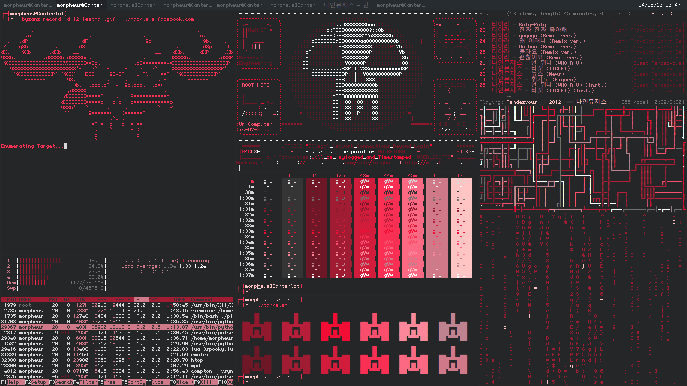

<h1 align="center">Welcome to my profile 😎</h1>

  

##💫 About Me:
🔭 I’m currently working on Cloud Computing & Full-Stack Projects  👯 I’m looking to collaborate on Open Source & Web Development Projects   🤝 I’m looking for help with Advanced Cloud Architectures & DevOps Practices   🌱 I’m currently learning Docker, Kubernetes, and Virtual Machines   💬 Ask me about React.js, Laravel, TailwindCSS, or Full-Stack Development  ⚡ Fun fact: I enjoy building unique UI designs that stand out from the usual templates! 

## 🌐 Socials:
  

# 💻 Tech Stack:
                                            
# 📊 GitHub Stats:
 
 

### ✍️ Random Dev Quote

---

<!-- Proudly created with GPRM ( https://gprm.itsvg.in ) -->
